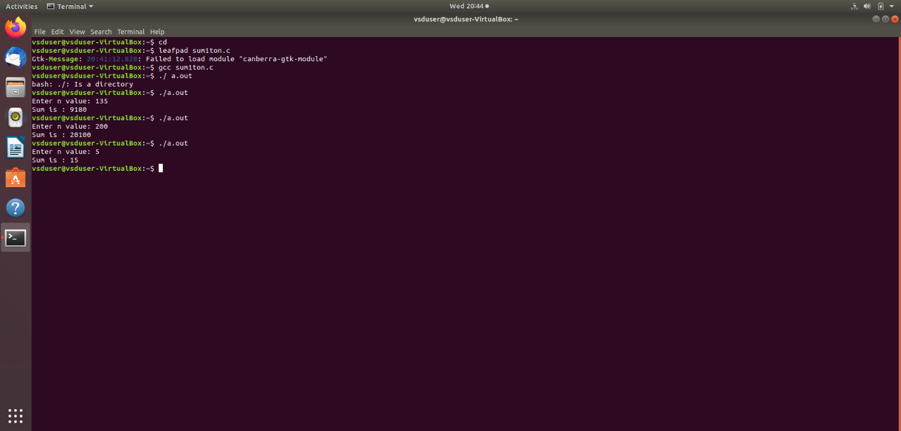

# RISC-V Internship program powered by SAMSUNG and VSD
### This RISC-V Internship using VSDSquadron Mini is based on RISC-V architecture and uses open-source tools to teach students about VLSI SoC Design and RISC-V. The instructor and guide for this internship is Kunal Ghosh Sir, Founder of VSD.

# Basic Details

### Name: Chirag M
### College: The National Institute Of Engineering
### Email ID: kenkerechirag@gmail.com

# TASK1 

 Task-1: C based lab screenshots 

 

